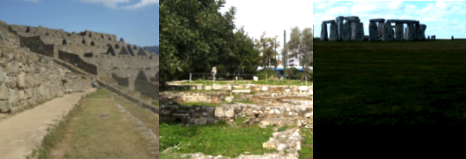

## Project Overview

Welcome to the **Landmark Classification & Tagging for Social Media Project**!
In this project, you will build a deep learning pipeline to process real-world images and deploy a trained model inside an app.

Given an image, your app will predict the most likely landmark among 50 classes using a custom-trained Convolutional Neural Network.

This project demonstrates your ability to combine several components: image preprocessing, CNN architecture design, model training, transfer learning, evaluation, and inference. In this implementation, we used **AdamW** — a modern optimizer known for improving generalization — instead of the standard Adam optimizer.


*Figure: Examples of landmarks from the dataset used in this project. Macchu Picchu, Temple of the Olympian Zeus, and Stonehenge*

### Why We're Here

Photo-sharing platforms often need location data to enable search, tagging, and organization. While GPS metadata can help, it's often missing. In such cases, machine learning can infer locations by recognizing landmarks within images.

This project is the first step toward solving that challenge by training a CNN model from scratch, improving it with transfer learning, and deploying it in a basic app interface.

### Key Enhancements

* A custom CNN architecture with simplified design for efficiency and stability
* Optimized training using the **AdamW** optimizer
* Extensive image augmentation to support generalization
* Integration of **early stopping**, **learning rate scheduling**, and **TorchScript export**

By the end of this project, you will have a system capable of:

* Training a model from scratch
* Evaluating performance on unseen test images
* Exporting the model for deployment
* Accepting arbitrary input images and returning a ranked list of predicted landmark locations

---

## Project Instructions

### Getting started

You can complete this project either locally or in the Udacity Workspace (recommended for convenience and GPU access).

#### Setting up Project in Workspace

1. Launch the workspace locally or in the cloud. 
2. When prompted, select **GPU** for faster training.
3. The environment is pre-configured; you can immediately begin development.

#### Setting up locally

Local setup is for advanced users. You will need to:

1. Clone the repo:

   ```bash
   git clone https://github.com/snufkinwa/Landmark-Classification-Tagging-for-Social-Media-Project.git
   cd Landmark-Classification-Tagging-for-Social-Media-Project
   ```

2. Create and activate a conda environment:

   ```bash
   conda create --name landmark_cnn_project -y python=3.7.6
   conda activate landmark_cnn_project
   ```

3. Install dependencies:

   ```bash
   pip install -r requirements.txt
   ```

4. Launch JupyterLab:

   ```bash
   pip install jupyterlab
   jupyter lab
   ```

---

## Developing your project

Follow the notebooks in order:

1. `cnn_from_scratch.ipynb` — Build and train a custom CNN using AdamW
2. `transfer_learning.ipynb` — Use a pretrained model (e.g., ResNet18)
3. `app.ipynb` — Run inference on new images with TorchScript export

---

## Evaluation

Your project will be reviewed using the CNN rubric. Key requirements:

* Image transforms
* Custom CNN architecture 
* AdamW optimizer configuration
* Training loop, validation, and test accuracy >= 60%
* TorchScript export

---

## Submission Checklist

Your GitHub repo must include:

* Completed notebooks: `cnn_from_scratch.ipynb`, `transfer_learning.ipynb`, and `app.ipynb`
* Trained model files in `checkpoints/` (no dataset files)
* Report: `report.html` or `report.pdf`

Click "Submit Project" in the Udacity classroom when ready.

---

## Dataset Info

The dataset is a curated subset of the **Google Landmarks Dataset v2**. It includes:

* 50 landmark classes
* Over 10,000 labeled training images
* A separate test set without labels

---

## Future Work

Consider exploring data wrangling and data cleaning techniques to improve class balance or investigate mislabeled examples. These techniques are especially useful when working with real-world image datasets where noise can affect performance.
